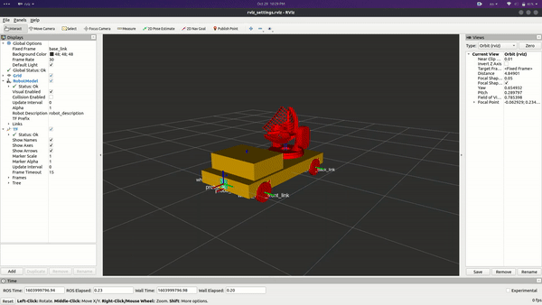
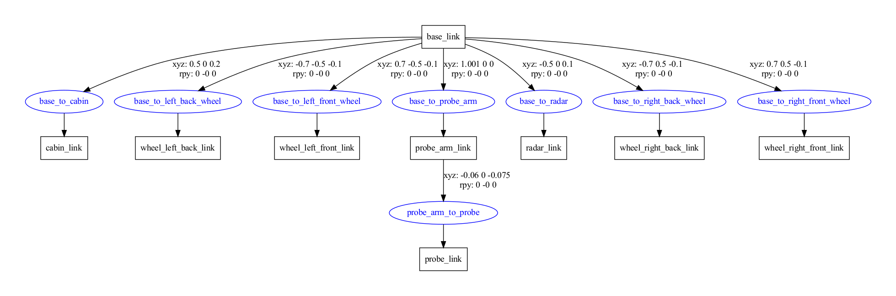
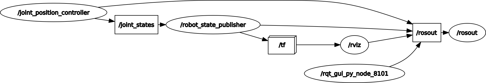

# IntroToROS

## Description

This repo contains simple URDF robot definition and control of it via C++ joint state publisher

Here is the Prober robot in Rviz:

URDF graph for the Prober:

And here is a ROS graph when `create_robot.launch` is running:

As we can see here, `/joint_position_controller` publishes Prober's current joint state into the `/joint_states` topic. At the same time `/robot_state_publisher` is listenning for messages in `/joint_states`, and if a message arrives, it converts it into `/tf` format which is consumed by Rviz.

## How to run

- Add the `urdf_prober_robot` package to your `catkin_ws/src`
- Execute `catkin_make && source devel/setup.bash`
- Execute `roslaunch urdf_prober_robot create_robot.launch`

If you want to generate the URDF graph use those commands:

1. `rosrun xacro xacro robot.urdf > model.urdf`
2. `urdf_to_graphiz model.urdf`

`1.` makes sure no Xacro macroses are left in the robot.urdf and `2.` produces the `model.pdf` file
